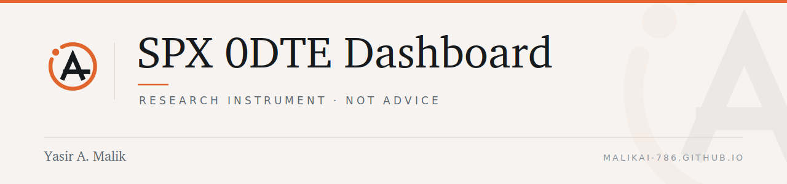

  <picture>
    <source media="(prefers-color-scheme: dark)" srcset=".github/brand/banner-dark.png">
    <source media="(prefers-color-scheme: light)" srcset=".github/brand/banner-light.png">
    
  </picture>

# SPX 0DTE AI Signal Dashboard

A single-page dashboard for the SPX 0DTE research instrument — intraday
bias, model comparison, peer-score averaging, and defined-risk decision
discipline.

Static HTML. Tailwind and Chart.js load from CDN; there is no build step.

> ### Disclaimer
>
> **Educational and research purposes only.** This is not investment
> advice, not a recommendation, and not an offer to buy or sell any
> security. It is not a track record. Options trading involves substantial
> risk of loss. Do not act on anything here with real money.

## Branding

Runs on the shared identity system — ember `#E0662E` as the anchor colour,
warm graphite as the record, Charter for headlines, mono for labels.
Because the page is built on Tailwind utility classes, the identity is
applied as a layer over them rather than by re-pointing variables.

---

<b>Yasir A. Malik</b> · Audit · Risk · Governance — <a href="https://malikai-786.github.io">malikai-786.github.io</a> · <a href="https://linkedin.com/in/yasiramalik">LinkedIn</a>
